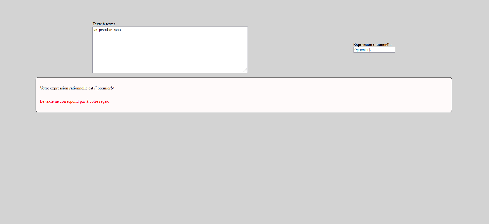

# Projet : petit jeu de regex

## Introduction
Dans le cadre de ce projet, nous allons développer un petit jeu offrant à l'utilisateur d'encoder un texte de son choix ainsi qu'une RegEx, et de tester automatiquement si le texte encodé valide la RegEx.

## Exemple
